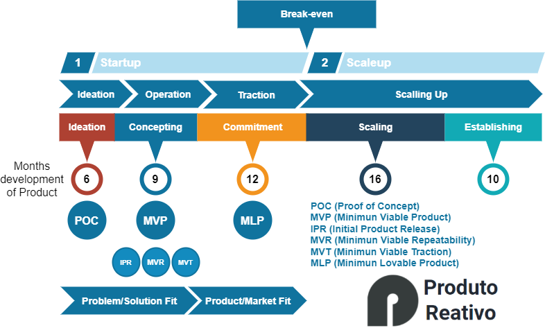
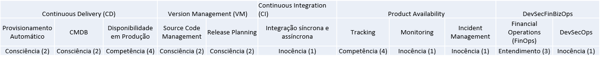
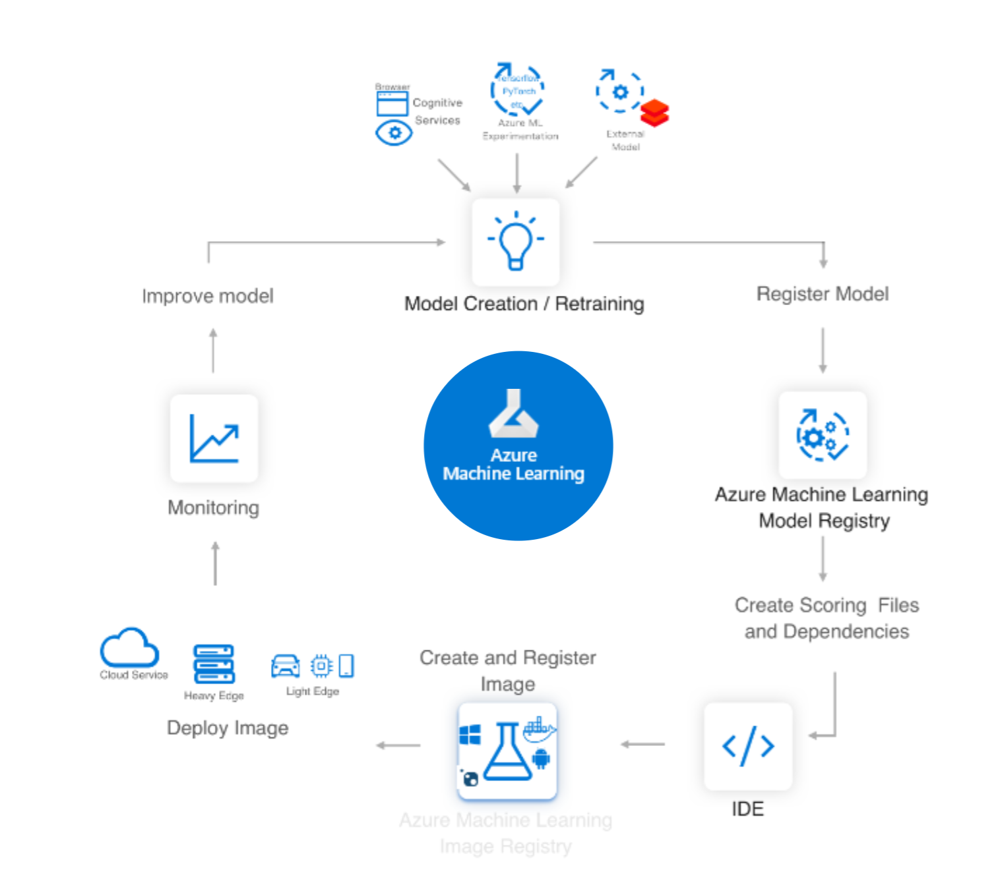
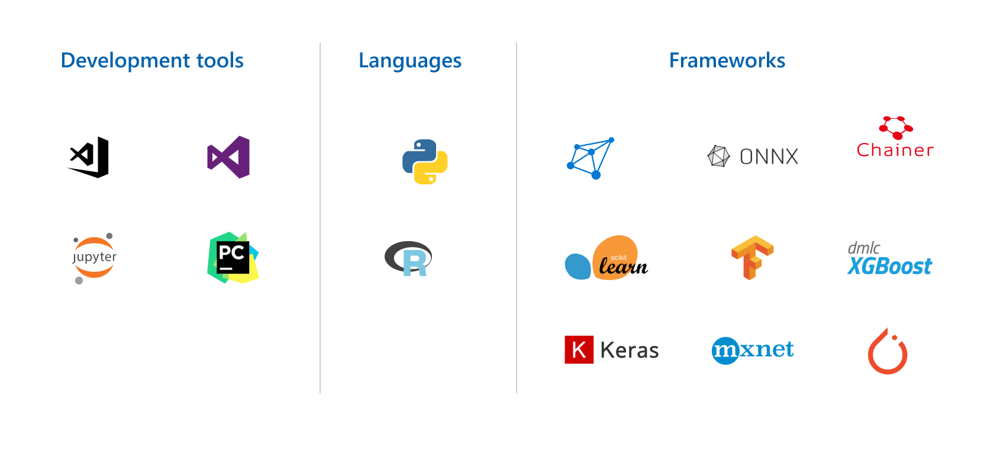

# Wayne Enterprises

## Company

  
[https://wayne.tech](https://dc.fandom.com/wiki/Wayne_Enterprises)  

Wayne é uma corporação que atua em diversas áreas e fez a transição para o mundo digital com dispositivos e softwares para proteção pessoal de forças policiais, militares e segurança privada.  

### Mulheres no Cap Tables
Helena Wayne (CFO)  
[Linkedin](https://en.wikipedia.org/wiki/Huntress_(Helena_Wayne))  
Tel: (11) 444-4444  
Email: wayne.helena@wayne.tech

## Product

### Bat Armor

 

Produto em Operação e buscando investimento para tração.

### Product Strategy

Para a indústria de segurança pública e privada, o Bat Armor é uma armadura inteligente com plataforma digital IOT que utiliza aprendizado de máquina para realizar otimização de programas, manutenção preditiva e prescritiva para a melhor abordagem utilizando o equipamento.  
Diferentemente das soluções da LexCorp e Stagg Enterprises que monitoram apenas indicadores básicos em tempo real, a Bat Armor atua de forma preditiva, aplicando AI para detectar falhas no equipamento, prever pontos de perigo e melhoria de atuação pelo profissional de segurança.

### Assessment

#### Modelo de Maturidade
  

[Raw Data](https://startupstudio-my.sharepoint.com/:x:/g/personal/christiano_milfont_weimpact_tech/ESxVURjA9bFAswbXLh3dKjsBJA6cxH-6MRS63wTbDpHVVg?e=Oa4pyh)  

[Form Request](https://forms.office.com/Pages/DesignPage.aspx#FormId=PFtBNkXp7kC_p-PVgOOkosYesZCxN79Kl6h0EvzeRxFUODlQQzU5MU0xNFY0QVI0QTI4Q0FPUUU3OS4u)  
#### Arquitetura
 

#### Ambiente tecnológico
 

* Pode ser uma lista

#### Ambiente de produtividade

Lista com os fornecedores de:  
1.  Mensageria e compartilhamento: Slack, Teams, etc;
2.  Meeting: Google Meet, Teams, Zoom, etc;
3.  Ferramentas de planejamento: Trello, Jira, MS Planner, etc;
4.  Ferramentas Office: Google Drive, MS Office, etc;
5.  Compartilhamento de arquivos: Google Drive, MS Onedrive, Dropox, etc;

Mais informações que ache importante.

### Team Building

#### Time de tecnologia do produto
**Nome**: Joseph Richard Santos, 27 anos, santos.joseph@wayne.tech  
**Cargo**: Engenheiro de Software para Backend, Sistemas Embarcados, IIOT e Robótica.
[https://www.linkedin.com/in/josephsantos/](https://www.linkedin.com/in/paulosantosphs/)
